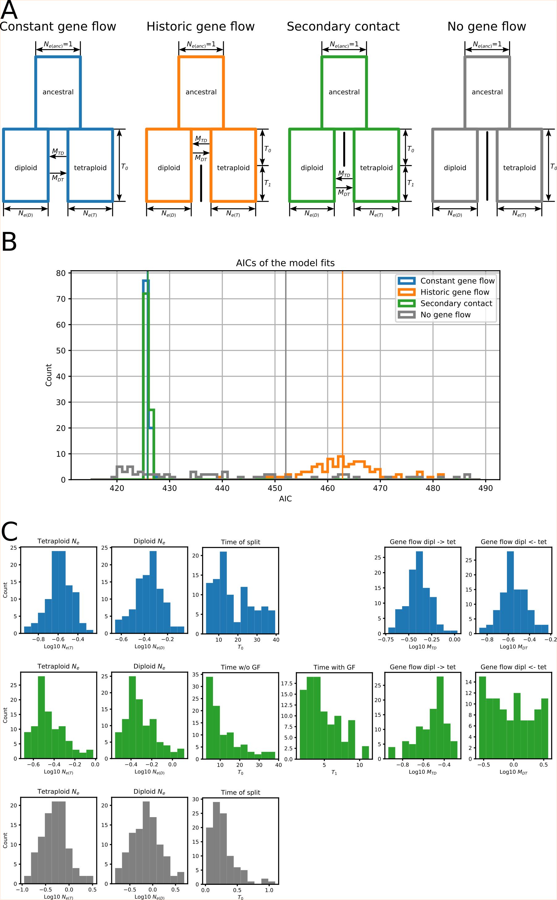

# Euphrasia-demographic-modelling
Code, data, and δaδi fits relating to Brown et al. 2022 (under revision at American Journal of Botany)

## Summary
Data (VCF): `Euphrasia_gbs_080520_fSNPs50_fINDs75_conserved_uni_scaff.vcf`  
Python script to run δaδi: `fits_general.py`  
Results (pickled): `FITS_general_4mod.dump`  
Checking an visualising results (html version of a Jupyter notebook): `dadi_fits_general.html`  
Plots are located in `/plots`  

## Results

